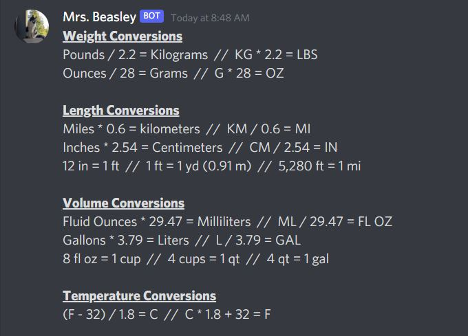
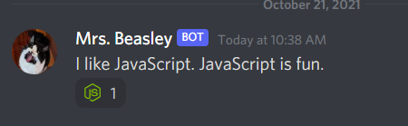

# Mrs. Beasley (Discord Bot) 

##### This bot is my volunteer work for the /r/loseitchallenges hosted on Reddit and Discord quarterly. Functions of this bot are made to assist in the moderation of the challenge but I have designed to be a compliment to any server. Feel free to fork and make it your own, or add to your own server using the links below.

##### The bot is named after my cat, Mrs. Beasley, and takes after her sassy personality.

---

## [Support Mrs. Beasley and Her Developer Here!](./DONATE.md)

## Add to you server

### Standard Link (Recommended):

##### [Click Here to Add to Your Server](https://discord.com/api/oauth2/authorize?client_id=857711589150556200&permissions=534119967814&scope=bot)

### Admin Link (Not Recommended):

#### Note: This link grants the bot administrative privileges to your server! Use at your own risk.

##### [Click Here to Add to Your Server](https://discord.com/api/oauth2/authorize?client_id=857711589150556200&permissions=8&scope=bot)

## User Commands

### `!convert` & `!conversions` &mdash; Unit Converter Commands

- `!convert` to make a unit conversion to a select unit
  - *Syntax:* `!convert <value> <unit abbreviation> to <new unit abbreviation>`
  - *Example:* `!convert 20 kg to g` or `!convert 55 gal to qt`

---    
```
    !convert 360 mi to m

    //Output: 
```


---

- `!conversions` to pull up a unit conversion chart

---

    !conversions

    //output:


---
-->

---
### `!spell` &mdash; Text Emojifier

- `!spell` to emojify a message

---

    !spell hello world

    //Output:


---

### `!eightball` &mdash; Fortune Teller

- `!eightball` to make a prediction

---

    !eightball

    //Output:


    !eightball Will I be rich?

    //Output:


  
  - *Note:* Sometimes she is rude

---

### `!roll` &mdash; Roll Virtual Dice

- `!roll` to roll virtual dice

  - *Syntax:* `!roll [number of dice]d[number of sides]` Number of dice can be left blank and will default to one die with `!roll d[number of sides]`

  - *Example:* `!roll 3d6` for 3 d6 dice or `!roll d12` for 1 d12 die.

---

    !roll 3d6

    //Output:


    !roll d12

    //Output:


---

### `!echo` &mdash; Make Mrs. Beasley Repeat a Message

- `!echo` to have the bot repeat a user's message. The bot will automatically delete the user's original message after 0.5s.

  - *Example:* `echo >>Hello world!` Output: `Hello world!`

---

```
    !echo I like JavaScript. JavaScript is fun.

    //Output:
```



---

### `!react` &mdash; Make Mrs. Beasley React to the Previous Message

- `!react` will make Mrs. Beasley react to a previous user's message somewhat anonymously. The message sent will automatically be deleted.

```
Input:

!react <emoji>

Output:
```


### `!bingo` &mdash; BINGO!

- `!bingo` to add get a pat on the back for filling out a bingo sheet.

---

```
    !bingo

    //Output:
```


You also are able to assign roles using this command if you fork the project. In `./modules/bingoroles.js` I have a template function that you can export to `./commands/bingo.js`.

---

- `!choose` to make the bot decide something for you. Prompts are separated by commas.  

  - *Syntax:* `!choose [something], [something], [something]`

---

```
    !choose go for a swim, go for a bike ride, go for a run

    //Output:
```


---

### `!poll` [Beta]

- Use `!poll` to create a poll in the chat.
- *Syntax:* `!poll` `<question>` `?` `<possible response>` `;` `<possible response>` `;` `<possible response>`
- The question is separted from the responses via the question mark and repsonses are separated from eachother with semicolons.
- Possible responses are assigned an emoji, and the bot reacts to its auto generated message with the listed options.

### `!donate` &mdash; Donate to this Project

- While this project is open source and there is no expectation for you to donate, donations to one of Mrs. Beasley's wallets would be much appreciated.
- Use `!donate` to pull up a list of sub-commands, which provide information to specific wallets.
    - *Note:* the word "support" in a message will trigger this command too!
- `!donate <wallet>` will provide the wallet address. Currently supported wallets:
    - Bitcoin / BTC
    - Ethereum / ETH 
    - Cosmos / ATOM 
    - Solana / SOL 
    - Monero / XMR

```
Input:

!Donate

Output:

*Message embed with further command information*

Input:

!donate <wallet>

Output:

*Message embed with wallet address*
```
- You can type the currency name or symbol as an argument.
- I will work on getting support for fiat donations as well.


