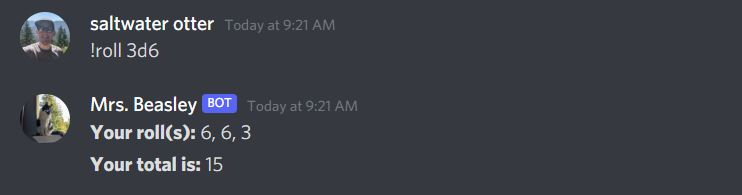
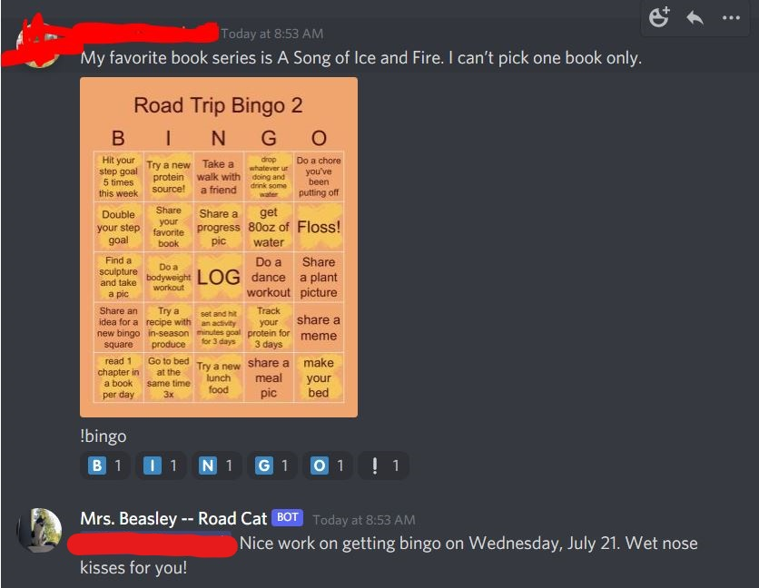

# Mrs. Beasley (Discord Bot)

#### This bot is my volunteer work for the /r/loseitchallenges hosted on Reddit and Discord quarterly. Functions of this bot are made to assist in the moderation of the challenge, and has already saved me more time than completing the tasks it does manually.

#### The bot is named after my cat, Mrs. Beasley, and takes after her sassy personality.

## User Commands:

### Unit Converter Commands

- `!convert` to make a unit conversion to a select unit
  - *Syntax:* `!convert <value> <unit abbreviation> to <new unit abbreviation>`
  - *Example:* `!convert 20 kg to g` or `!convert 55 gal to qt`

---    

    !convert 360 mi to m

    //Output: 

---

Mrs. Beasley will automatically do some conversions if a message contains a value and an accepted unit as an argument.

    190 lbs

    //Output:

- `!conversions` to pull up a unit conversion chart

---

    !conversions

    //output:

---

- `!converttocat` to convert a message into cat language

---

    !converttocat Hello world!

    //Output: meow meow mow mow 

---

- `!spell` to emojify a message

---

    !spell hello world

    //Output:

---

- `!eightball` to make a prediction

---

    !eightball

    //Output:

    !eightball Will I be rich?

    //Output:

  
  - *Note:* Sometimes she is rude

---

- `!forms` to summon challenge logs

---

    !forms

    //Output:

---

- `!schedule` to summon challenge schedule

---

    !schedule

    //Output:

---

- `!roll` to roll virtual dice

  - *Syntax:* `!roll [number of dice]d[number of sides]` Number of dice can be left blank and will default to one die with `!roll d[number of sides]`

  - *Example:* `!roll 3d6` for 3 d6 dice or `!roll d12` for 1 d12 die.

---

    !roll 3d6

    //Output:

    !roll d12

    //Output:

---

- `!tdee` to calculate estimated energy expenditure. 

  - *Syntax:* `!tdee [male/female *or* m/f] [age] [height in inches--number only] [weing in pounds--number only]`

  - *Examples:* `!tdee m 23 74 195` for a 23 year old, 6'2" man who is 195 lbs. `!tdee m 41 64 131` for a 131 lb, 5'4", 41 yo women.

    - `!metric tdee` will do the same. Replace height in inches with height in centimeters, and weight in pounds with weight in kilograms. 

---

    !tdee male 23 74 195
    !tdee m 23 74 195

    //Output:

---

- `!bmi` will calculate a user's body mass index.

  - *Syntax:* `!bmi [height in inches] [weight in pounds]`

  - *Example:* `!bmi 74 195` for a 6'2", 195 lb person

    - `!metric bmi` will do the same. Replace height in inches with height in centimeters, and weight in pounds with weight in kilograms. 

---

    !bmi 74 195

    //Output:

---

- `echo >>` to have the bot repeat a user's message. The bot will automatically delete the user's original message after 0.5s.

  - *Example:* `echo >>Hello world!` Output: `Hello world!`

---

    echo >>Hello World!

    //Output:

---

- `!bingo` to add the weekly `Got Bingo` role to yourself.

---

    !bingo

    //Output:

---

- `!choose` to make the bot decide something for you. Prompts are separated by commas.  

  - *Syntax:* `!choose [something], [something], [something]`

---

    !choose go for a swim, go for a bike ride, go for a run

    //Output:

---

## Admin Commands

### QOTD Functions

- `$qotd` Posts the question of the day in the general chat and prompts admin to delete the question from the database after posting in the admin bot chat

---

    $qotd

    //Output

    In the bot channel (admin only)

    In the general chat

---

- `$new` adds a new question from the database

---

    $new This is a test question

    //Output:

---

- `$del` deletes a question from the database 
  - *Note:* Spelling, caps, spacing, and markdown features must be exact, so it is best to copy and paste from the list of questions.

---

    $del This is a test question

    //Output:

---

- `$list` lists all the questions in the database

---

    $list

    //Output:

---

### Add Mrs. Beasley to your server:

###### Link is in the environmental variables file.

